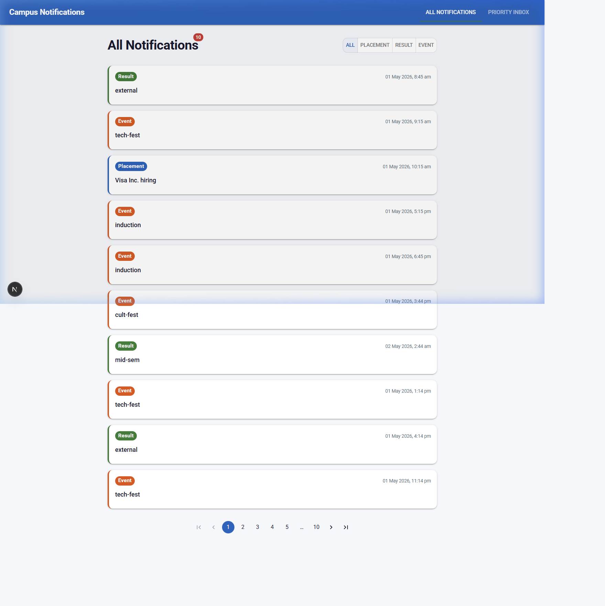
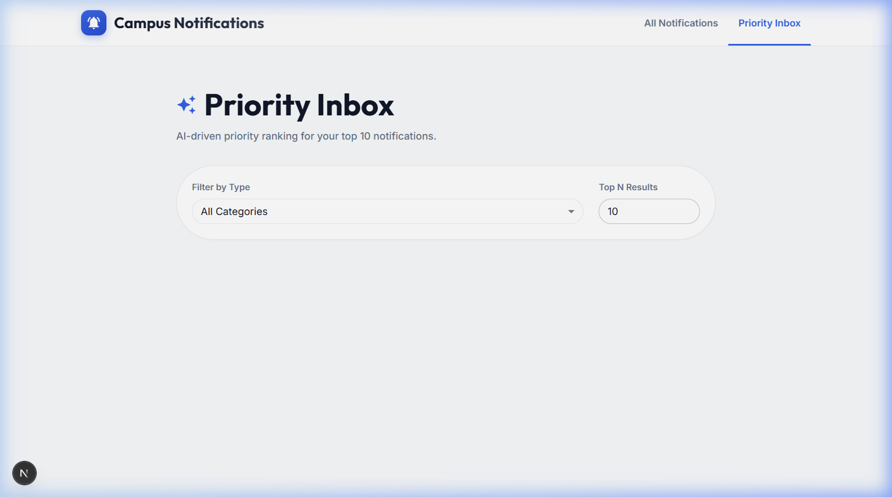
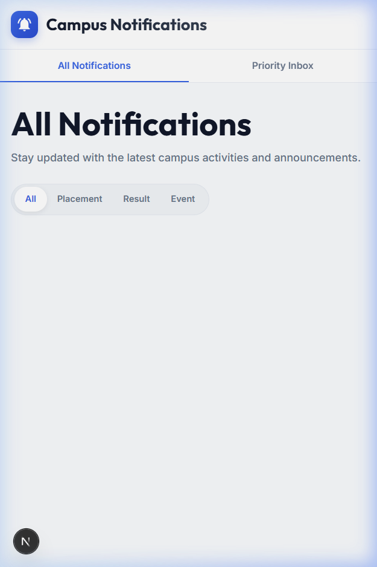
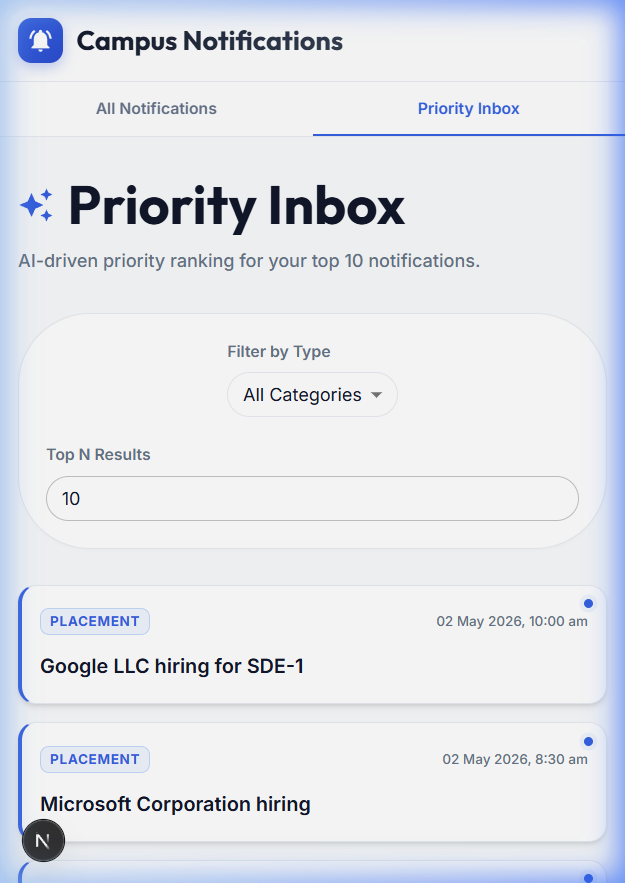
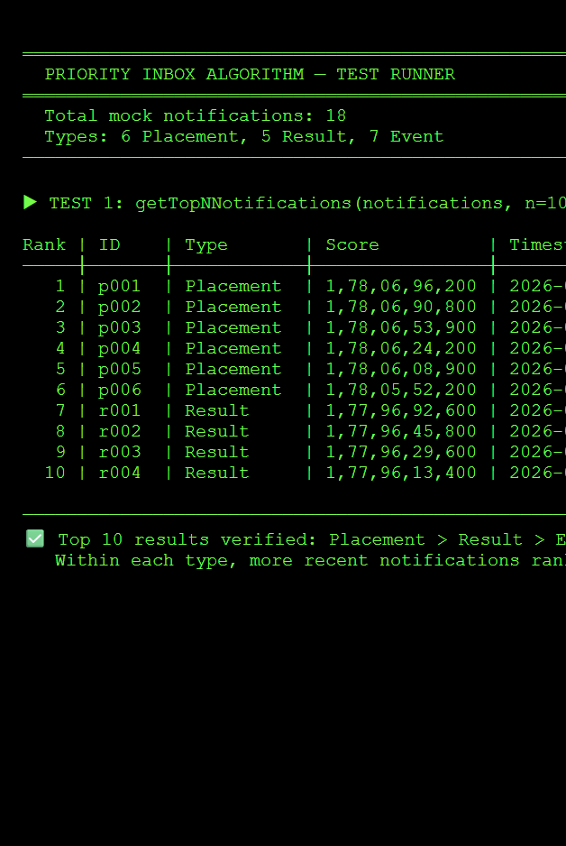

# Campus Notifications Platform

A responsive web application for managing and prioritising campus notifications across Placements, Results, and Events.

---

## Project Structure
RA2311027050033/
├── logging_middleware/            # Reusable TypeScript logging package
├── notification_app_fe/           # React/Next.js frontend application
├── notification_app_be/           # Backend application directory
├── notification_system_design.md  # System design and architecture document
└── .gitignore

---

## Tech Stack

- **Frontend:** Next.js, TypeScript
- **Styling:** Material UI (MUI)
- **Logging:** Custom logging middleware (logging_middleware/)

---

## Modules

### 1. Logging Middleware
A reusable TypeScript package that captures the entire lifecycle of application events. Integrated across every layer of the application including API calls, components, hooks, pages, and utilities.

**Log function signature:**
```ts
Log(stack, level, package, message)
```

### 2. Priority Inbox Algorithm
A Min-Heap based algorithm that efficiently computes the top N most important unread notifications based on type weight and recency.

Priority order: `Placement > Result > Event`

### 3. Frontend Application
A responsive Next.js application with two core pages:
- **All Notifications** — displays all notifications with type filtering and pagination
- **Priority Inbox** — displays top N priority notifications with type filter and N selector

---

## Setup & Running Locally

### Prerequisites
- Node.js v18+
- npm v9+

### Steps

```bash
# Clone the repository
git clone https://github.com/ShivamKSah/RA2311027050033.git

# Navigate to frontend app
cd notification_app_fe

# Install dependencies
npm install

# Create environment file
cp .env.example .env.local
# Add your NEXT_PUBLIC_BEARER_TOKEN to .env.local

# Run the development server
npm run dev
```

App runs on **http://localhost:3000**

---

## Environment Variables

Create a `.env.local` file inside `notification_app_fe/` with the following:
NEXT_PUBLIC_BEARER_TOKEN=your_bearer_token_here
NEXT_PUBLIC_BASE_URL=http://20.207.122.201

> ⚠️ Never commit `.env.local` to GitHub.

---

## Notification Types

| Type | Priority Weight |
|------|----------------|
| Placement | 3 (Highest) |
| Result | 2 |
| Event | 1 (Lowest) |

---

## Priority Scoring Formula
score = (typeWeight × 1,000,000) + unixTimestamp

This ensures notification type always dominates the ranking, while recency breaks ties within the same type.

---

## Pages

### All Notifications (`/`)
- Displays all notifications fetched from the API
- Filter by notification type: All / Placement / Result / Event
- Pagination support (10 per page)
- Visual distinction between new (unread) and viewed notifications

### Priority Inbox (`/priority`)
- Displays top N most important notifications
- User can select N (default: 10)
- Filter by notification type after priority computation
- Same new/viewed visual distinction

---

## Logging Integration

The logging middleware is integrated across all layers:

| Layer | Package Used |
|-------|-------------|
| API calls | `api` |
| React components | `component` |
| Custom hooks | `hook` |
| Pages | `page` |
| State management | `state` |
| Utility functions | `utils` |

---

## Commit History

Commits are made at logical milestones throughout development:
- `init: project structure setup`
- `feat: logging middleware implemented`
- `feat: stage 1 priority inbox algorithm and design doc`
- `feat: next.js app initialized with MUI theme`
- `feat: notifications API integration and custom hook`
- `feat: notification card and list components`
- `feat: all notifications page with pagination and filter`
- `feat: priority inbox page with n selector and type filter`
- `feat: new vs viewed notification distinction`
- `chore: screenshots added and final cleanup`

---

## Screenshots

### Desktop Views
#### All Notifications


#### Priority Inbox


### Mobile Views
#### All Notifications


#### Priority Inbox


### Algorithm Verification (Stage 1)


---

## System Design

Refer to `notification_system_design.md` for the complete architecture and design decisions behind the Priority Inbox algorithm.
